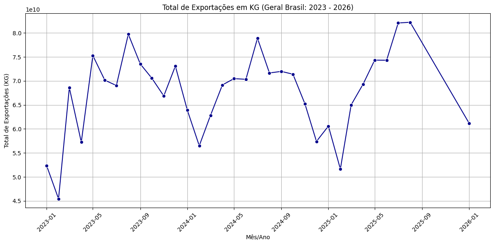
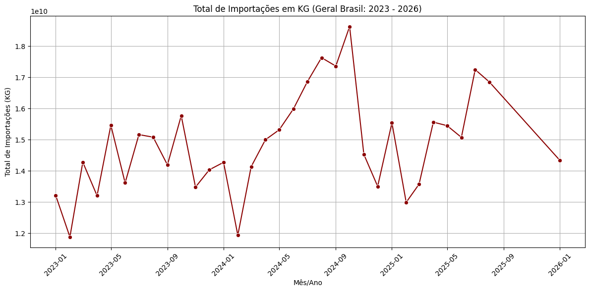
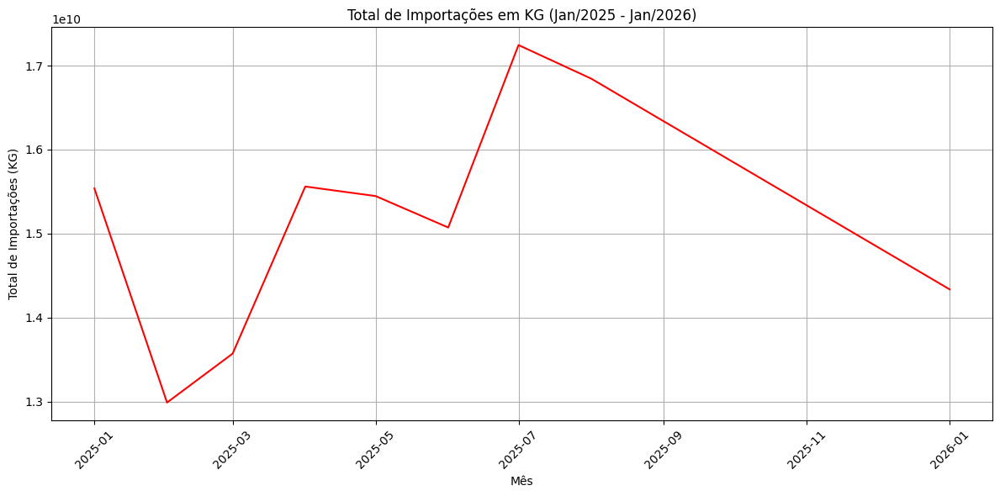

# Tratamento e Consolidação de Dados - Comex Stat (2023 a 2026)

## 📌 Sobre o Projeto
Este repositório contém os scripts desenvolvidos em Python, executados no ambiente Google Colab, para o processo de Extração, Transformação e Carga (ETL) dos dados abertos de comércio exterior brasileiro disponibilizados pelo portal Comex Stat. 


O objetivo principal desta aplicação é tratar as bases de dados brutas de Importação e Exportação, realizando o cruzamento (*merge*) com tabelas auxiliares para enriquecer as informações numéricas com suas respectivas descrições em texto. Os dados processados são exportados em formato `.csv`, estruturados para consumo em plataformas de visualização de dados e *Business Intelligence* (BI), como o Power BI.

**Nota Acadêmica:** Este projeto é referente a uma atividade desenvolvida para a FATEC Jessen Vidal. Trata-se da atualização e reaproveitamento de um código estruturado no semestre anterior (que contemplava os anos de 2023, 2024 e 2025), agora expandido e validado para incluir o processamento dos dados consolidados do ano de **2026**. Utilizando agora de codigos para formular graficos como:

## Graficos 






## ⚙️ Estrutura do Projeto
O tratamento de dados foi segmentado em duas frentes de análise distintas, visando atender a diferentes níveis de granularidade:

1. **Análise Municipal:** Detalhamento em nível municipal, cruzando dados de produtos, estados e municípios.
2. **Análise Nacional (Geral):** Visão macroscópica do Brasil, agregando dados por vias de transporte, unidades da Receita Federal e países de origem/destino.

Abaixo estão os scripts correspondentes a cada uma das abordagens.

---

### 1. Script de Tratamento por Municípios
Este script processa os arquivos contendo o sufixo `_MUN`, relacionando-os com as tabelas de Códigos SH4, Países e Unidades Federativas/Municípios.

```python
import pandas as pd
from google.colab import drive

# Montagem do diretório do Google Drive
drive.mount('/content/drive')
origem = '/content/drive/My Drive/Data/Comexstat/'

# --- MAPEAMENTO DOS ARQUIVOS DE ORIGEM ---
arquivo_1 = origem + 'EXP_2023_MUN.csv'
arquivo_2 = origem + 'EXP_2024_MUN.csv'
arquivo_3 = origem + 'EXP_2025_MUN.csv'
arquivo_7 = origem + 'EXP_2026_MUN.csv'

arquivo_4 = origem + 'IMP_2023_MUN.csv'
arquivo_5 = origem + 'IMP_2024_MUN.csv'
arquivo_6 = origem + 'IMP_2025_MUN.csv'
arquivo_8 = origem + 'IMP_2026_MUN.csv'

sh = origem + 'NCM_SH.csv'
pais = origem + 'PAIS.csv'
uf_mun = origem + 'UF_MUN.csv'

# --- LEITURA DAS BASES DE DADOS ---
exp23 = pd.read_csv(arquivo_1, low_memory=False, sep=';', encoding='UTF-8')
exp24 = pd.read_csv(arquivo_2, low_memory=False, sep=';', encoding='UTF-8')
exp25 = pd.read_csv(arquivo_3, low_memory=False, sep=';', encoding='UTF-8')
exp26 = pd.read_csv(arquivo_7, low_memory=False, sep=';', encoding='UTF-8')

imp23 = pd.read_csv(arquivo_4, low_memory=False, sep=';', encoding='UTF-8')
imp24 = pd.read_csv(arquivo_5, low_memory=False, sep=';', encoding='UTF-8')
imp25 = pd.read_csv(arquivo_6, low_memory=False, sep=';', encoding='UTF-8')
imp26 = pd.read_csv(arquivo_8, low_memory=False, sep=';', encoding='UTF-8')

exeufmun = pd.read_csv(uf_mun, low_memory=False, sep=';', encoding='latin1')
exesh = pd.read_csv(sh, low_memory=False, sep=';', encoding='latin1')
exepais = pd.read_csv(pais, low_memory=False, sep=';', encoding='latin1')

# --- TRATAMENTO DAS TABELAS AUXILIARES ---
exepais = exepais[['CO_PAIS','NO_PAIS']].drop_duplicates(subset='CO_PAIS')
exeufmun = exeufmun[['CO_MUN_GEO','NO_MUN_MIN']].drop_duplicates(subset='CO_MUN_GEO')
exesh = exesh[['CO_SH4','NO_SH4_POR']].drop_duplicates(subset='CO_SH4')

# --- CONSOLIDAÇÃO INICIAL ---
exp23final = pd.concat([exp23], ignore_index=True)
exp24final = pd.concat([exp24], ignore_index=True)
exp25final = pd.concat([exp25], ignore_index=True)
exp26final = pd.concat([exp26], ignore_index=True)

imp23final = pd.concat([imp23], ignore_index=True)
imp24final = pd.concat([imp24], ignore_index=True)
imp25final = pd.concat([imp25], ignore_index=True)
imp26final = pd.concat([imp26], ignore_index=True)

# --- CRUZAMENTO DE DADOS (MERGES) - EXPORTAÇÃO ---
exp23final = exp23.merge(exesh[['CO_SH4','NO_SH4_POR']], left_on='SH4', right_on='CO_SH4', how='left')
exp23final = exp23final.merge(exeufmun[['CO_MUN_GEO','NO_MUN_MIN']], left_on='CO_MUN', right_on='CO_MUN_GEO', how='left')
exp23final = exp23final.merge(exepais[['CO_PAIS','NO_PAIS']], left_on='CO_PAIS', right_on='CO_PAIS', how='left')

exp24final = exp24.merge(exesh[['CO_SH4','NO_SH4_POR']], left_on='SH4', right_on='CO_SH4', how='left')
exp24final = exp24final.merge(exeufmun[['CO_MUN_GEO','NO_MUN_MIN']], left_on='CO_MUN', right_on='CO_MUN_GEO', how='left')
exp24final = exp24final.merge(exepais[['CO_PAIS','NO_PAIS']], left_on='CO_PAIS', right_on='CO_PAIS', how='left')

exp25final = exp25.merge(exesh[['CO_SH4','NO_SH4_POR']], left_on='SH4', right_on='CO_SH4', how='left')
exp25final = exp25final.merge(exeufmun[['CO_MUN_GEO','NO_MUN_MIN']], left_on='CO_MUN', right_on='CO_MUN_GEO', how='left')
exp25final = exp25final.merge(exepais[['CO_PAIS','NO_PAIS']], left_on='CO_PAIS', right_on='CO_PAIS', how='left')

exp26final = exp26.merge(exesh[['CO_SH4','NO_SH4_POR']], left_on='SH4', right_on='CO_SH4', how='left')
exp26final = exp26final.merge(exeufmun[['CO_MUN_GEO','NO_MUN_MIN']], left_on='CO_MUN', right_on='CO_MUN_GEO', how='left')
exp26final = exp26final.merge(exepais[['CO_PAIS','NO_PAIS']], left_on='CO_PAIS', right_on='CO_PAIS', how='left')

# --- CRUZAMENTO DE DADOS (MERGES) - IMPORTAÇÃO ---
imp23final = imp23.merge(exesh[['CO_SH4','NO_SH4_POR']], left_on='SH4', right_on='CO_SH4', how='left')
imp23final = imp23final.merge(exeufmun[['CO_MUN_GEO','NO_MUN_MIN']], left_on='CO_MUN', right_on='CO_MUN_GEO', how='left')
imp23final = imp23final.merge(exepais[['CO_PAIS','NO_PAIS']], left_on='CO_PAIS', right_on='CO_PAIS', how='left')

imp24final = imp24.merge(exesh[['CO_SH4','NO_SH4_POR']], left_on='SH4', right_on='CO_SH4', how='left')
imp24final = imp24final.merge(exeufmun[['CO_MUN_GEO','NO_MUN_MIN']], left_on='CO_MUN', right_on='CO_MUN_GEO', how='left')
imp24final = imp24final.merge(exepais[['CO_PAIS','NO_PAIS']], left_on='CO_PAIS', right_on='CO_PAIS', how='left')

imp25final = imp25.merge(exesh[['CO_SH4','NO_SH4_POR']], left_on='SH4', right_on='CO_SH4', how='left')
imp25final = imp25final.merge(exeufmun[['CO_MUN_GEO','NO_MUN_MIN']], left_on='CO_MUN', right_on='CO_MUN_GEO', how='left')
imp25final = imp25final.merge(exepais[['CO_PAIS','NO_PAIS']], left_on='CO_PAIS', right_on='CO_PAIS', how='left')

imp26final = imp26.merge(exesh[['CO_SH4','NO_SH4_POR']], left_on='SH4', right_on='CO_SH4', how='left')
imp26final = imp26final.merge(exeufmun[['CO_MUN_GEO','NO_MUN_MIN']], left_on='CO_MUN', right_on='CO_MUN_GEO', how='left')
imp26final = imp26final.merge(exepais[['CO_PAIS','NO_PAIS']], left_on='CO_PAIS', right_on='CO_PAIS', how='left')

# --- EXPORTAÇÃO DOS ARQUIVOS FINAIS (.CSV) ---
imp23final.to_csv(origem + 'imp23finalmun.csv', index=False)
imp24final.to_csv(origem + 'imp24finalmun.csv', index=False)
imp25final.to_csv(origem + 'imp25finalmun.csv', index=False)
imp26final.to_csv(origem + 'imp26finalmun.csv', index=False)

# Tratamento e Consolidação de Dados - Comex Stat (2023 a 2026)

## 📌 Sobre o Projeto
Este repositório contém os scripts desenvolvidos em Python, executados no ambiente Google Colab, para o processo de Extração, Transformação e Carga (ETL) dos dados abertos de comércio exterior brasileiro disponibilizados pelo portal Comex Stat. 

O objetivo principal desta aplicação é tratar as bases de dados brutas de Importação e Exportação, realizando o cruzamento (*merge*) com tabelas auxiliares para enriquecer as informações numéricas com suas respectivas descrições em texto. Os dados processados são exportados em formato `.csv`, estruturados para consumo em plataformas de visualização de dados e *Business Intelligence* (BI), como o Power BI.

**Nota Acadêmica:** Este projeto é referente a uma atividade desenvolvida para a FATEC. Trata-se da atualização e reaproveitamento de um código estruturado no semestre anterior (que contemplava os anos de 2023, 2024 e 2025), agora expandido e validado para incluir o processamento dos dados consolidados do ano de **2026**.

## ⚙️ Estrutura do Projeto
O tratamento de dados foi segmentado em duas frentes de análise distintas, visando atender a diferentes níveis de granularidade:

1. **Análise Municipal:** Detalhamento em nível municipal, cruzando dados de produtos, estados e municípios.
2. **Análise Nacional (Geral):** Visão macroscópica do Brasil, agregando dados por vias de transporte, unidades da Receita Federal e países de origem/destino.

Abaixo estão os scripts correspondentes a cada uma das abordagens.

---

### 1. Script de Tratamento por Municípios
Este script processa os arquivos contendo o sufixo `_MUN`, relacionando-os com as tabelas de Códigos SH4, Países e Unidades Federativas/Municípios.

```python
import pandas as pd
from google.colab import drive

# Montagem do diretório do Google Drive
drive.mount('/content/drive')
origem = '/content/drive/My Drive/Data/Comexstat/'

# --- MAPEAMENTO DOS ARQUIVOS DE ORIGEM ---
arquivo_1 = origem + 'EXP_2023_MUN.csv'
arquivo_2 = origem + 'EXP_2024_MUN.csv'
arquivo_3 = origem + 'EXP_2025_MUN.csv'
arquivo_7 = origem + 'EXP_2026_MUN.csv'

arquivo_4 = origem + 'IMP_2023_MUN.csv'
arquivo_5 = origem + 'IMP_2024_MUN.csv'
arquivo_6 = origem + 'IMP_2025_MUN.csv'
arquivo_8 = origem + 'IMP_2026_MUN.csv'

sh = origem + 'NCM_SH.csv'
pais = origem + 'PAIS.csv'
uf_mun = origem + 'UF_MUN.csv'

# --- LEITURA DAS BASES DE DADOS ---
exp23 = pd.read_csv(arquivo_1, low_memory=False, sep=';', encoding='UTF-8')
exp24 = pd.read_csv(arquivo_2, low_memory=False, sep=';', encoding='UTF-8')
exp25 = pd.read_csv(arquivo_3, low_memory=False, sep=';', encoding='UTF-8')
exp26 = pd.read_csv(arquivo_7, low_memory=False, sep=';', encoding='UTF-8')

imp23 = pd.read_csv(arquivo_4, low_memory=False, sep=';', encoding='UTF-8')
imp24 = pd.read_csv(arquivo_5, low_memory=False, sep=';', encoding='UTF-8')
imp25 = pd.read_csv(arquivo_6, low_memory=False, sep=';', encoding='UTF-8')
imp26 = pd.read_csv(arquivo_8, low_memory=False, sep=';', encoding='UTF-8')

exeufmun = pd.read_csv(uf_mun, low_memory=False, sep=';', encoding='latin1')
exesh = pd.read_csv(sh, low_memory=False, sep=';', encoding='latin1')
exepais = pd.read_csv(pais, low_memory=False, sep=';', encoding='latin1')

# --- TRATAMENTO DAS TABELAS AUXILIARES ---
exepais = exepais[['CO_PAIS','NO_PAIS']].drop_duplicates(subset='CO_PAIS')
exeufmun = exeufmun[['CO_MUN_GEO','NO_MUN_MIN']].drop_duplicates(subset='CO_MUN_GEO')
exesh = exesh[['CO_SH4','NO_SH4_POR']].drop_duplicates(subset='CO_SH4')

# --- CONSOLIDAÇÃO INICIAL ---
exp23final = pd.concat([exp23], ignore_index=True)
exp24final = pd.concat([exp24], ignore_index=True)
exp25final = pd.concat([exp25], ignore_index=True)
exp26final = pd.concat([exp26], ignore_index=True)

imp23final = pd.concat([imp23], ignore_index=True)
imp24final = pd.concat([imp24], ignore_index=True)
imp25final = pd.concat([imp25], ignore_index=True)
imp26final = pd.concat([imp26], ignore_index=True)

# --- CRUZAMENTO DE DADOS (MERGES) - EXPORTAÇÃO ---
exp23final = exp23.merge(exesh[['CO_SH4','NO_SH4_POR']], left_on='SH4', right_on='CO_SH4', how='left')
exp23final = exp23final.merge(exeufmun[['CO_MUN_GEO','NO_MUN_MIN']], left_on='CO_MUN', right_on='CO_MUN_GEO', how='left')
exp23final = exp23final.merge(exepais[['CO_PAIS','NO_PAIS']], left_on='CO_PAIS', right_on='CO_PAIS', how='left')

exp24final = exp24.merge(exesh[['CO_SH4','NO_SH4_POR']], left_on='SH4', right_on='CO_SH4', how='left')
exp24final = exp24final.merge(exeufmun[['CO_MUN_GEO','NO_MUN_MIN']], left_on='CO_MUN', right_on='CO_MUN_GEO', how='left')
exp24final = exp24final.merge(exepais[['CO_PAIS','NO_PAIS']], left_on='CO_PAIS', right_on='CO_PAIS', how='left')

exp25final = exp25.merge(exesh[['CO_SH4','NO_SH4_POR']], left_on='SH4', right_on='CO_SH4', how='left')
exp25final = exp25final.merge(exeufmun[['CO_MUN_GEO','NO_MUN_MIN']], left_on='CO_MUN', right_on='CO_MUN_GEO', how='left')
exp25final = exp25final.merge(exepais[['CO_PAIS','NO_PAIS']], left_on='CO_PAIS', right_on='CO_PAIS', how='left')

exp26final = exp26.merge(exesh[['CO_SH4','NO_SH4_POR']], left_on='SH4', right_on='CO_SH4', how='left')
exp26final = exp26final.merge(exeufmun[['CO_MUN_GEO','NO_MUN_MIN']], left_on='CO_MUN', right_on='CO_MUN_GEO', how='left')
exp26final = exp26final.merge(exepais[['CO_PAIS','NO_PAIS']], left_on='CO_PAIS', right_on='CO_PAIS', how='left')

# --- CRUZAMENTO DE DADOS (MERGES) - IMPORTAÇÃO ---
imp23final = imp23.merge(exesh[['CO_SH4','NO_SH4_POR']], left_on='SH4', right_on='CO_SH4', how='left')
imp23final = imp23final.merge(exeufmun[['CO_MUN_GEO','NO_MUN_MIN']], left_on='CO_MUN', right_on='CO_MUN_GEO', how='left')
imp23final = imp23final.merge(exepais[['CO_PAIS','NO_PAIS']], left_on='CO_PAIS', right_on='CO_PAIS', how='left')

imp24final = imp24.merge(exesh[['CO_SH4','NO_SH4_POR']], left_on='SH4', right_on='CO_SH4', how='left')
imp24final = imp24final.merge(exeufmun[['CO_MUN_GEO','NO_MUN_MIN']], left_on='CO_MUN', right_on='CO_MUN_GEO', how='left')
imp24final = imp24final.merge(exepais[['CO_PAIS','NO_PAIS']], left_on='CO_PAIS', right_on='CO_PAIS', how='left')

imp25final = imp25.merge(exesh[['CO_SH4','NO_SH4_POR']], left_on='SH4', right_on='CO_SH4', how='left')
imp25final = imp25final.merge(exeufmun[['CO_MUN_GEO','NO_MUN_MIN']], left_on='CO_MUN', right_on='CO_MUN_GEO', how='left')
imp25final = imp25final.merge(exepais[['CO_PAIS','NO_PAIS']], left_on='CO_PAIS', right_on='CO_PAIS', how='left')

imp26final = imp26.merge(exesh[['CO_SH4','NO_SH4_POR']], left_on='SH4', right_on='CO_SH4', how='left')
imp26final = imp26final.merge(exeufmun[['CO_MUN_GEO','NO_MUN_MIN']], left_on='CO_MUN', right_on='CO_MUN_GEO', how='left')
imp26final = imp26final.merge(exepais[['CO_PAIS','NO_PAIS']], left_on='CO_PAIS', right_on='CO_PAIS', how='left')

# --- EXPORTAÇÃO DOS ARQUIVOS FINAIS (.CSV) ---
imp23final.to_csv(origem + 'imp23finalmun.csv', index=False)
imp24final.to_csv(origem + 'imp24finalmun.csv', index=False)
imp25final.to_csv(origem + 'imp25finalmun.csv', index=False)
imp26final.to_csv(origem + 'imp26finalmun.csv', index=False)import pandas as pd
import matplotlib.pyplot as plt
import seaborn as sns
from google.colab import drive

# Montagem do diretório do Google Drive
drive.mount('/content/drive')
origem = '/content/drive/My Drive/Data/Comexstat/'

# --- MAPEAMENTO DOS ARQUIVOS DE ORIGEM ---
arquivo_1 = origem + 'EXP_2023.csv'
arquivo_2 = origem + 'EXP_2024.csv'
arquivo_3 = origem + 'EXP_2025.csv'
arquivo_7 = origem + 'EXP_2026.csv'

arquivo_4 = origem + 'IMP_2023.csv'
arquivo_5 = origem + 'IMP_2024.csv'
arquivo_6 = origem + 'IMP_2025.csv'
arquivo_8 = origem + 'IMP_2026.csv'

ncm = origem + 'NCM.csv'
pais = origem + 'PAIS.csv'
vias = origem + 'VIA.csv'
urf = origem + 'URF.csv'

# --- LEITURA DAS BASES DE DADOS ---
exp23 = pd.read_csv(arquivo_1, low_memory=False, sep=';', encoding='UTF-8')
exp24 = pd.read_csv(arquivo_2, low_memory=False, sep=';', encoding='UTF-8')
exp25 = pd.read_csv(arquivo_3, low_memory=False, sep=';', encoding='UTF-8')
exp26 = pd.read_csv(arquivo_7, low_memory=False, sep=';', encoding='UTF-8')

imp23 = pd.read_csv(arquivo_4, low_memory=False, sep=';', encoding='UTF-8')
imp24 = pd.read_csv(arquivo_5, low_memory=False, sep=';', encoding='UTF-8')
imp25 = pd.read_csv(arquivo_6, low_memory=False, sep=';', encoding='UTF-8')
imp26 = pd.read_csv(arquivo_8, low_memory=False, sep=';', encoding='UTF-8')

exencm = pd.read_csv(ncm, low_memory=False, sep=';', encoding='latin1')
exepais = pd.read_csv(pais, low_memory=False, sep=';', encoding='latin1')
exevias = pd.read_csv(vias, low_memory=False, sep=';', encoding='latin1')
exeurf = pd.read_csv(urf, low_memory=False, sep=';', encoding='latin1')

# --- CRUZAMENTO DE DADOS (MERGES) - EXPORTAÇÃO ---
exp23final = exp23.merge(exencm[['CO_NCM','NO_NCM_POR']], on='CO_NCM', how='left').merge(exepais[['CO_PAIS','NO_PAIS']], on='CO_PAIS', how='left').merge(exevias[['CO_VIA','NO_VIA']], on='CO_VIA', how='left').merge(exeurf[['CO_URF','NO_URF']], on='CO_URF', how='left')
exp24final = exp24.merge(exencm[['CO_NCM','NO_NCM_POR']], on='CO_NCM', how='left').merge(exepais[['CO_PAIS','NO_PAIS']], on='CO_PAIS', how='left').merge(exevias[['CO_VIA','NO_VIA']], on='CO_VIA', how='left').merge(exeurf[['CO_URF','NO_URF']], on='CO_URF', how='left')
exp25final = exp25.merge(exencm[['CO_NCM','NO_NCM_POR']], on='CO_NCM', how='left').merge(exepais[['CO_PAIS','NO_PAIS']], on='CO_PAIS', how='left').merge(exevias[['CO_VIA','NO_VIA']], on='CO_VIA', how='left').merge(exeurf[['CO_URF','NO_URF']], on='CO_URF', how='left')
exp26final = exp26.merge(exencm[['CO_NCM','NO_NCM_POR']], on='CO_NCM', how='left').merge(exepais[['CO_PAIS','NO_PAIS']], on='CO_PAIS', how='left').merge(exevias[['CO_VIA','NO_VIA']], on='CO_VIA', how='left').merge(exeurf[['CO_URF','NO_URF']], on='CO_URF', how='left')

# --- CRUZAMENTO DE DADOS (MERGES) - IMPORTAÇÃO ---
imp23final = imp23.merge(exencm[['CO_NCM','NO_NCM_POR']], on='CO_NCM', how='left').merge(exepais[['CO_PAIS','NO_PAIS']], on='CO_PAIS', how='left').merge(exevias[['CO_VIA','NO_VIA']], on='CO_VIA', how='left').merge(exeurf[['CO_URF','NO_URF']], on='CO_URF', how='left')
imp24final = imp24.merge(exencm[['CO_NCM','NO_NCM_POR']], on='CO_NCM', how='left').merge(exepais[['CO_PAIS','NO_PAIS']], on='CO_PAIS', how='left').merge(exevias[['CO_VIA','NO_VIA']], on='CO_VIA', how='left').merge(exeurf[['CO_URF','NO_URF']], on='CO_URF', how='left')
imp25final = imp25.merge(exencm[['CO_NCM','NO_NCM_POR']], on='CO_NCM', how='left').merge(exepais[['CO_PAIS','NO_PAIS']], on='CO_PAIS', how='left').merge(exevias[['CO_VIA','NO_VIA']], on='CO_VIA', how='left').merge(exeurf[['CO_URF','NO_URF']], on='CO_URF', how='left')
imp26final = imp26.merge(exencm[['CO_NCM','NO_NCM_POR']], on='CO_NCM', how='left').merge(exepais[['CO_PAIS','NO_PAIS']], on='CO_PAIS', how='left').merge(exevias[['CO_VIA','NO_VIA']], on='CO_VIA', how='left').merge(exeurf[['CO_URF','NO_URF']], on='CO_URF', how='left')

# --- EXPORTAÇÃO DOS ARQUIVOS FINAIS (.CSV) ---
exp23final.to_csv(origem + 'exp23finalGeral.csv', index=False)
exp24final.to_csv(origem + 'exp24finalGeral.csv', index=False)
exp25final.to_csv(origem + 'exp25finalGeral.csv', index=False)
exp26final.to_csv(origem + 'exp26finalGeral.csv', index=False)

imp23final.to_csv(origem + 'imp23finalGeral.csv', index=False)
imp24final.to_csv(origem + 'imp24finalGeral.csv', index=False)
imp25final.to_csv(origem + 'imp25finalGeral.csv', index=False)
imp26final.to_csv(origem + 'imp26finalGeral.csv', index=False)

# --- CONCATENAÇÃO DOS ANOS (2023 a 2026) ---
imp_final = pd.concat([imp23final, imp24final, imp25final, imp26final], ignore_index=True)
exp_final = pd.concat([exp23final, exp24final, exp25final, exp26final], ignore_index=True)

# --- VISUALIZAÇÃO DE DADOS (GRÁFICOS NACIONAIS) ---
# Criação de coluna de data formatada
imp_final['DATE'] = pd.to_datetime(imp_final['CO_ANO'].astype(str) + '-' + imp_final['CO_MES'].astype(str).str.zfill(2) + '-01')
exp_final['DATE'] = pd.to_datetime(exp_final['CO_ANO'].astype(str) + '-' + exp_final['CO_MES'].astype(str).str.zfill(2) + '-01')

# Agrupamento de dados por data
df_monthly_imp = imp_final.groupby('DATE')['KG_LIQUIDO'].sum().reset_index()
df_monthly_exp = exp_final.groupby('DATE')['KG_LIQUIDO'].sum().reset_index()

# Plotagem: Importação Nacional
plt.figure(figsize=(12, 6))
sns.lineplot(data=df_monthly_imp, x='DATE', y='KG_LIQUIDO', color='darkred', marker='o')
plt.title('Total de Importações em KG (Geral Brasil: 2023 - 2026)')
plt.xlabel('Mês/Ano')
plt.ylabel('Total de Importações (KG)')
plt.grid(True)
plt.xticks(rotation=45)
plt.tight_layout()
plt.show()

# Plotagem: Exportação Nacional
plt.figure(figsize=(12, 6))
sns.lineplot(data=df_monthly_exp, x='DATE', y='KG_LIQUIDO', color='darkblue', marker='o')
plt.title('Total de Exportações em KG (Geral Brasil: 2023 - 2026)')
plt.xlabel('Mês/Ano')
plt.ylabel('Total de Exportações (KG)')
plt.grid(True)
plt.xticks(rotation=45)
plt.tight_layout()
plt.show()

# --- RESULTADOS BÁSICOS NO TERMINAL ---
coluna = 'NO_PAIS'
print(f'\nTotal de operações EXPORTAÇÃO por {coluna}:')
print(exp_final[coluna].value_counts().sort_values(ascending=False).head(10))

print(f'\nTotal de operações IMPORTAÇÃO por {coluna}:')
print(imp_final[coluna].value_counts().sort_values(ascending=False).head(10))

import pandas as pd
import matplotlib.pyplot as plt
import seaborn as sns
from google.colab import drive

# Conectando no Drive
drive.mount('/content/drive')
origem = '/content/drive/My Drive/Data/Comexstat/'

# --- MAPEAMENTO DOS ARQUIVOS (MUNICÍPIOS) ---
arquivo_1 = origem + 'EXP_2023_MUN.csv'
arquivo_2 = origem + 'EXP_2024_MUN.csv'
arquivo_3 = origem + 'EXP_2025_MUN.csv'
arquivo_7 = origem + 'EXP_2026_MUN.csv' # Adicionado 2026

arquivo_4 = origem + 'IMP_2023_MUN.csv'
arquivo_5 = origem + 'IMP_2024_MUN.csv'
arquivo_6 = origem + 'IMP_2025_MUN.csv'
arquivo_8 = origem + 'IMP_2026_MUN.csv' # Adicionado 2026

sh = origem + 'NCM_SH.csv'
pais = origem + 'PAIS.csv'
uf_mun = origem + 'UF_MUN.csv'

# --- LEITURA DAS BASES ---
exp23 = pd.read_csv(arquivo_1, low_memory=False, sep=';', encoding='UTF-8')
exp24 = pd.read_csv(arquivo_2, low_memory=False, sep=';', encoding='UTF-8')
exp25 = pd.read_csv(arquivo_3, low_memory=False, sep=';', encoding='UTF-8')
exp26 = pd.read_csv(arquivo_7, low_memory=False, sep=';', encoding='UTF-8')

imp23 = pd.read_csv(arquivo_4, low_memory=False, sep=';', encoding='UTF-8')
imp24 = pd.read_csv(arquivo_5, low_memory=False, sep=';', encoding='UTF-8')
imp25 = pd.read_csv(arquivo_6, low_memory=False, sep=';', encoding='UTF-8')
imp26 = pd.read_csv(arquivo_8, low_memory=False, sep=';', encoding='UTF

import pandas as pd
import matplotlib.pyplot as plt
import seaborn as sns
from google.colab import drive

# --- CONECTANDO NO DRIVE ---
drive.mount('/content/drive', force_remount=True)
origem = '/content/drive/My Drive/Data/Comexstat/'

# --- MAPEAMENTO DOS ARQUIVOS (MUNICÍPIOS) ---
arquivo_1 = origem + 'EXP_2023_MUN.csv'
arquivo_2 = origem + 'EXP_2024_MUN.csv'
arquivo_3 = origem + 'EXP_2025_MUN.csv'
arquivo_7 = origem + 'EXP_2026_MUN.csv' 

arquivo_4 = origem + 'IMP_2023_MUN.csv'
arquivo_5 = origem + 'IMP_2024_MUN.csv'
arquivo_6 = origem + 'IMP_2025_MUN.csv'
arquivo_8 = origem + 'IMP_2026_MUN.csv' 

sh = origem + 'NCM_SH.csv'
pais = origem + 'PAIS.csv'
uf_mun = origem + 'UF_MUN.csv'

# --- LEITURA DAS BASES ---
exp23 = pd.read_csv(arquivo_1, low_memory=False, sep=';', encoding='UTF-8')
exp24 = pd.read_csv(arquivo_2, low_memory=False, sep=';', encoding='UTF-8')
exp25 = pd.read_csv(arquivo_3, low_memory=False, sep=';', encoding='UTF-8')
exp26 = pd.read_csv(arquivo_7, low_memory=False, sep=';', encoding='UTF-8')

imp23 = pd.read_csv(arquivo_4, low_memory=False, sep=';', encoding='UTF-8')
imp24 = pd.read_csv(arquivo_5, low_memory=False, sep=';', encoding='UTF-8')
imp25 = pd.read_csv(arquivo_6, low_memory=False, sep=';', encoding='UTF-8')
imp26 = pd.read_csv(arquivo_8, low_memory=False, sep=';', encoding='UTF-8')

exeufmun = pd.read_csv(uf_mun, low_memory=False, sep=';', encoding='latin1')
exesh = pd.read_csv(sh, low_memory=False, sep=';', encoding='latin1')
exepais = pd.read_csv(pais, low_memory=False, sep=';', encoding='latin1')

# --- LIMPANDO AS AUXILIARES ---
exepais = exepais[['CO_PAIS','NO_PAIS']].drop_duplicates(subset='CO_PAIS')
exeufmun = exeufmun[['CO_MUN_GEO','NO_MUN_MIN']].drop_duplicates(subset='CO_MUN_GEO')
exesh = exesh[['CO_SH4','NO_SH4_POR']].drop_duplicates(subset='CO_SH4')

# --- MERGES EXPORTAÇÃO ---
exp23final = exp23.merge(exesh[['CO_SH4','NO_SH4_POR']], left_on='SH4', right_on='CO_SH4', how='left').merge(exeufmun[['CO_MUN_GEO','NO_MUN_MIN']], left_on='CO_MUN', right_on='CO_MUN_GEO', how='left').merge(exepais[['CO_PAIS','NO_PAIS']], left_on='CO_PAIS', right_on='CO_PAIS', how='left')
exp24final = exp24.merge(exesh[['CO_SH4','NO_SH4_POR']], left_on='SH4', right_on='CO_SH4', how='left').merge(exeufmun[['CO_MUN_GEO','NO_MUN_MIN']], left_on='CO_MUN', right_on='CO_MUN_GEO', how='left').merge(exepais[['CO_PAIS','NO_PAIS']], left_on='CO_PAIS', right_on='CO_PAIS', how='left')
exp25final = exp25.merge(exesh[['CO_SH4','NO_SH4_POR']], left_on='SH4', right_on='CO_SH4', how='left').merge(exeufmun[['CO_MUN_GEO','NO_MUN_MIN']], left_on='CO_MUN', right_on='CO_MUN_GEO', how='left').merge(exepais[['CO_PAIS','NO_PAIS']], left_on='CO_PAIS', right_on='CO_PAIS', how='left')
exp26final = exp26.merge(exesh[['CO_SH4','NO_SH4_POR']], left_on='SH4', right_on='CO_SH4', how='left').merge(exeufmun[['CO_MUN_GEO','NO_MUN_MIN']], left_on='CO_MUN', right_on='CO_MUN_GEO', how='left').merge(exepais[['CO_PAIS','NO_PAIS']], left_on='CO_PAIS', right_on='CO_PAIS', how='left')

# --- MERGES IMPORTAÇÃO ---
imp23final = imp23.merge(exesh[['CO_SH4','NO_SH4_POR']], left_on='SH4', right_on='CO_SH4', how='left').merge(exeufmun[['CO_MUN_GEO','NO_MUN_MIN']], left_on='CO_MUN', right_on='CO_MUN_GEO', how='left').merge(exepais[['CO_PAIS','NO_PAIS']], left_on='CO_PAIS', right_on='CO_PAIS', how='left')
imp24final = imp24.merge(exesh[['CO_SH4','NO_SH4_POR']], left_on='SH4', right_on='CO_SH4', how='left').merge(exeufmun[['CO_MUN_GEO','NO_MUN_MIN']], left_on='CO_MUN', right_on='CO_MUN_GEO', how='left').merge(exepais[['CO_PAIS','NO_PAIS']], left_on='CO_PAIS', right_on='CO_PAIS', how='left')
imp25final = imp25.merge(exesh[['CO_SH4','NO_SH4_POR']], left_on='SH4', right_on='CO_SH4', how='left').merge(exeufmun[['CO_MUN_GEO','NO_MUN_MIN']], left_on='CO_MUN', right_on='CO_MUN_GEO', how='left').merge(exepais[['CO_PAIS','NO_PAIS']], left_on='CO_PAIS', right_on='CO_PAIS', how='left')
imp26final = imp26.merge(exesh[['CO_SH4','NO_SH4_POR']], left_on='SH4', right_on='CO_SH4', how='left').merge(exeufmun[['CO_MUN_GEO','NO_MUN_MIN']], left_on='CO_MUN', right_on='CO_MUN_GEO', how='left').merge(exepais[['CO_PAIS','NO_PAIS']], left_on='CO_PAIS', right_on='CO_PAIS', how='left')

# --- JUNTANDO TUDO E CRIANDO A DATA ---
imp_final = pd.concat([imp23final, imp24final, imp25final, imp26final], ignore_index=True)
exp_final = pd.concat([exp23final, exp24final, exp25final, exp26final], ignore_index=True)

imp_final['DATE'] = pd.to_datetime(imp_final['CO_ANO'].astype(str) + '-' + imp_final['CO_MES'].astype(str).str.zfill(2) + '-01')
exp_final['DATE'] = pd.to_datetime(exp_final['CO_ANO'].astype(str) + '-' + exp_final['CO_MES'].astype(str).str.zfill(2) + '-01')

# --- FILTRANDO IGUAL SEU PRINT (Jan/2025 a Jan/2026) ---
mask_imp = (imp_final['DATE'] >= '2025-01-01') & (imp_final['DATE'] <= '2026-01-31')
df_filtered_imp = imp_final[mask_imp].copy()

mask_exp = (exp_final['DATE'] >= '2025-01-01') & (exp_final['DATE'] <= '2026-01-31')
df_filtered_exp = exp_final[mask_exp].copy()

# --- AGRUPANDO POR DATA ---
df_monthly_imports = df_filtered_imp.groupby('DATE')['KG_LIQUIDO'].sum().reset_index()
df_monthly_exports = df_filtered_exp.groupby('DATE')['KG_LIQUIDO'].sum().reset_index()

# --- PLOTANDO O GRÁFICO DE IMPORTAÇÃO ---
plt.figure(figsize=(12, 6))
sns.lineplot(x='DATE', y='KG_LIQUIDO', data=df_monthly_imports, color='red')

plt.title('Total de Importações em KG (Jan/2025 - Jan/2026)')
plt.xlabel('Mês')
plt.ylabel('Total de Importações (KG)')
plt.grid(True)
plt.xticks(rotation=45)
plt.tight_layout()
plt.show()

# --- PLOTANDO O GRÁFICO DE EXPORTAÇÃO ---
plt.figure(figsize=(12, 6))
sns.lineplot(x='DATE', y='KG_LIQUIDO', data=df_monthly_exports, color='blue')

plt.title('Total de Exportações em KG (Jan/2025 - Jan/2026)')
plt.xlabel('Mês')
plt.ylabel('Total de Exportações (KG)')
plt.grid(True)
plt.xticks(rotation=45)
plt.tight_layout()
plt.show()
